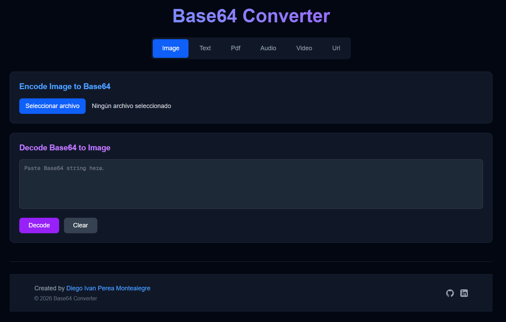

# Base64 Converter

This is a  web application that allows you to encode and decode Base64 images,audio, text, videos, and other files.


<p align="center">
  
</p>


## Getting Started

### Prerequisites

- Node.js 18+
- npm

### Installation

1. **Clone the repository**:

   ```bash
   git clone <repository-url>
   ```

2. **Install dependencies**:

   ```bash
   npm install
   # or
   yarn install
   # or
   pnpm install
   # or
   bun install
   ```

### Development

1. **Start the development server**:

   ```bash
   npm run dev
   # or
   yarn dev
   # or
   pnpm dev
   # or
   bun dev
   ```

2. **Open your browser**:
   Navigate to [http://localhost:3000](http://localhost:3000)


### Production Build

1. **Build the application**:

   ```bash
   npm run build
   ```

2. **Start production server**:
   ```bash
   npm start
   ```


### 📄 License

This project is licensed under the MIT License - see the [LICENSE](LICENSE) file for details.

---

## 👨‍💻 Author / Autor

**Diego Ivan Perea Montealegre**

- GitHub: [@diegoperea20](https://github.com/diegoperea20)

---

Created by [Diego Ivan Perea Montealegre](https://github.com/diegoperea20)